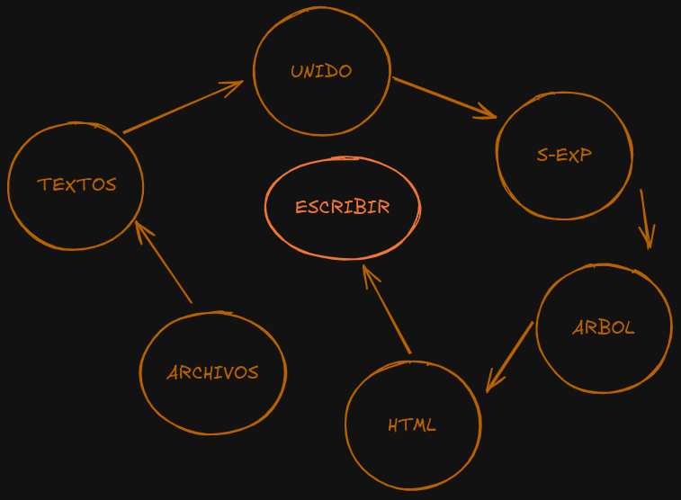

# Racket Recursive SSG


**LÓGICA INTERNA**

Un generador de sitios estáticos (SSG) minimalista escrito en **Racket**. 

Este proyecto fue construido siguiendo los principios de recursión pura ("The Little Schemer style"), evitando iteradores de alto nivel en favor de listas enlazadas y recursión explícita.

## 🚀 Características

- **Conversión Markdown a HTML**: Procesa múltiples archivos `.md` y los combina.
- ~~**Generación Recursiva de Índices**: Crea automáticamente un menú de navegación basado en los archivos de entrada.~~ *PRONTO*
- ~~**Temas CSS Dinámicos**: Permite elegir entre varios estilos visuales (Básico, Oscuro, Hacker) mediante input de consola.~~ *PRONTO*
- **S-Expressions**: Todo el HTML se construye manipulando listas de Racket (X-expressions) antes de renderizarse.

## 🛠️ Requisitos

- [Racket](https://racket-lang.org/) (Probado en Arch Linux)
- Librería `markdown`

### Instalación de dependencias

```bash
raco pkg install markdown
```

## 📂 Estructura del Proyecto

```text
.
├── contenido/       # Pon tus archivos .md aquí
├── salida/          # Aquí se generará el index.html
├── generador.rkt    # Código fuente principal
└── README.md
```

## 💻 Uso

1. Coloca tus archivos Markdown en la carpeta `contenido/`.
2. Ejecuta el script principal:

```bash
racket generador.rkt
```

3. ~~El programa te pedirá que elijas un tema visual. Escribe uno de los siguientes en la terminal:~~
   - ~~`basico`~~
   - ~~`oscuro`~~
   - ~~`hacker`~~ *PRONTO*

4. El sitio generado aparecerá en `salida/index.html`.

## 🧠 Filosofía del Código

A diferencia de los generadores comerciales, este proyecto prioriza la lógica recursiva sobre la eficiencia industrial. Se hace uso extensivo de:

- **`car`** y **`cdr`** para recorrer listas de archivos.
- **`cons`** para construir la estructura del DOM (HTML).
- Listas de asociación para la gestión de temas CSS.

Ejemplo de la lógica de construcción del DOM:

```racket
(define (envolver-en-html lista-contenido css)
  (list 'html
        (list 'head (list 'style css))
        (cons 'body lista-contenido)))
```

## 📝 Autor

**IOxBit**

---
Hecho con ❤️ y paréntesis (..)